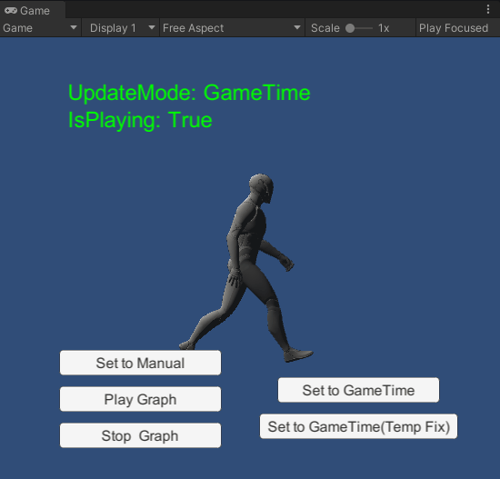

# Unity-Bug-Report-Playable-IN-37603

## About this issue

When the PlayableGraph is in `Manual` update mode and playing, changing its update mode to `non-Manual` will not cause the PlayableGraph to continue running.

## How to reproduce

1. Open the "SampleScene".
2. Enter play mode, and you will see the character walking in the Game view.
3. Click the "Set to Manual" button in the Game view.
4. Click the "Play Graph" button in the Game view.
5. Click the "Set to GameTime" button in the Game view.
   
Expected result: The character continue walking.

Actual result: The character remained paused.

## Solution

Please see the [`PlayableGraphPlayingTest.SetUpdateModeToGameTime`](./Assets/PlayableGraphPlayingTest.cs) method.
